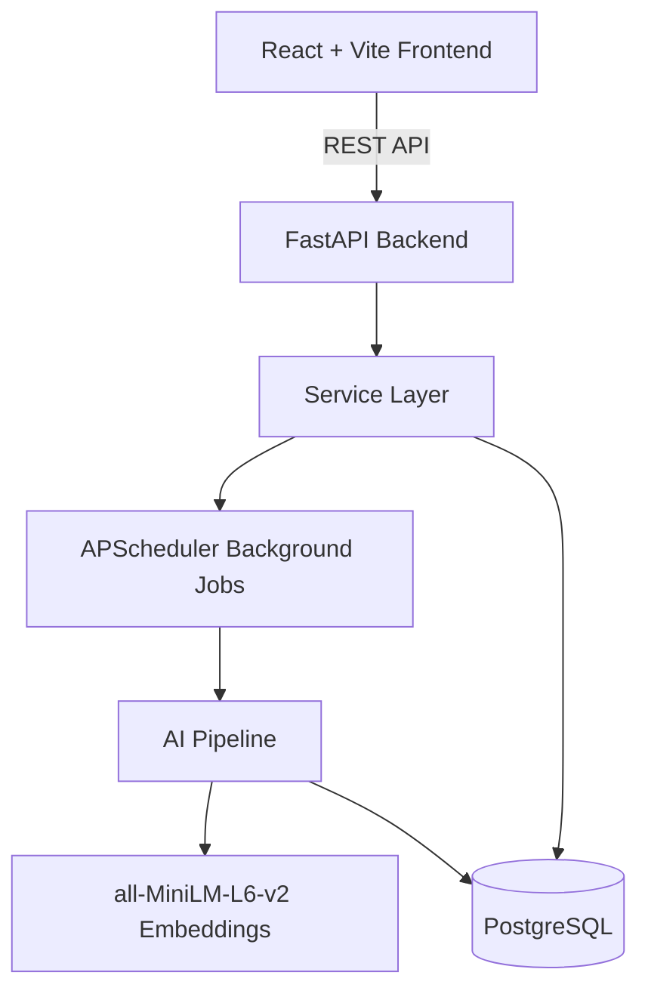

# Technical Architecture

## Architecture Diagram

## Layers
1. **Frontend**: React 18, Vite, Tailwind CSS. Implements the Dashboard, Workspace, and Job Operations.
2. **API Layer (FastAPI)**: Exposes endpoints for data ingestion, filtering, analytics, and job status.
3. **Service Layer**: Contains business logic (e.g., `ProcessService`, `JobService`, `ReportService`).
4. **Pipeline / Job Processing**: Handles the heavy lifting of parsing datasets, generating AI embeddings, and clustering.
5. **Database (PostgreSQL)**: Persists Incidents, Clusters, and Jobs. Managed via SQLAlchemy and Alembic.
